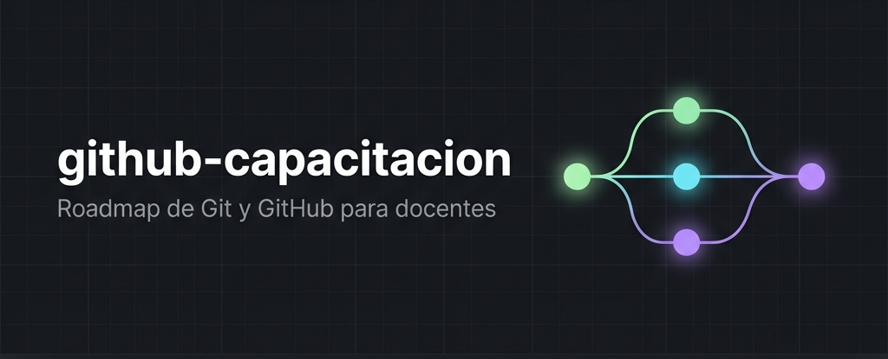

<p align="center">
  
</p>

<h1 align="center">github-capacitacion — Roadmap de Git y GitHub para docentes</h1>

<h3 align="center">Educational Architecture Case Study: Scalable Collaborative Workflows for Modern Classrooms</h3>

## Executive Summary

**github-capacitacion** es un marco de trabajo y repositorio de referencia diseñado para facilitar la adopción de Git y GitHub en entornos educativos. Este proyecto proporciona un roadmap estructurado para que docentes dominen el control de versiones, flujos de trabajo colaborativos y la gestión automatizada del aula, cerrando la brecha entre los estándares de ingeniería de software profesional y la pedagogía académica.

--------

## 🏗️ Architectural Vision

El repositorio está diseñado como un "Dual-Purpose Workspace", funcionando simultáneamente como un sitio de documentación listo para producción y un sandbox controlado para la práctica estudiantil.

### Core Principles:

*   **Asymmetric Workflow:** Separación clara entre el "Instructional Plane" (`sitio-docs/`) y el "Exercise Plane" (`practica/`).
*   **Git-Ops Pedagogy:** Implementación del modelo "Fork & Pull Request" como mecanismo primario de interacción, emulando entornos de desarrollo reales.
*   **Static Excellence:** Uso de Astro y Starlight para una documentación de alto rendimiento, searchable y escalable.

--------

## 🚀 Key Technical Milestones

### 1. Unified Documentation Engine
Implementación de un portal de documentación robusto usando **Astro/Starlight**, que incluye:
*   **Phase-based Learning:** Contenido estructurado desde fundamentos de Git hasta funciones avanzadas de GitHub Education.
*   **Contextual Guidance:** Integración de notas técnicas y diagramas arquitectónicos dentro de la documentación.

### 2. Practical Sandbox Governance
Estructura de directorio `practica/` bajo gobernanza estricta para enseñar:
*   **Standardized Profiling:** Uso de plantillas Markdown para la gestión de identidad de los participantes.
*   **Collaborative Concurrency:** Manejo de archivos compartidos (`muro-del-taller.md`) para entender la resolución de conflictos y contribuciones comunitarias.

--------

## 🛠️ Technology Stack

*   **Documentation:** [Astro](https://astro.build/), [Starlight](https://starlight.astro.build/), TypeScript.
*   **Version Control:** Git, GitHub (Optimizado para GitHub Classroom).
*   **Styling & UI:** Tailwind CSS (dentro del portal de documentación).
*   **Package Management:** pnpm.

--------

## 📁 Repository Topology (Architect's View)

```text
github-capacitacion/
├── practica/               # Sandbox: Zona de práctica y objetivo de PRs
│   └── participantes/      # Plantillas de perfil individual
├── sitio-docs/             # Control Plane: Sitio Astro/Starlight
│   ├── src/content/docs/   # Fuente de la documentación (Markdown)
│   └── astro.config.mjs    # Configuración de infraestructura
└── assets/                 # Brand identity y activos arquitectónicos
```

--------

**Author: Milton Velásquez — Lead Architect | Gavanti Engineering Lab**
